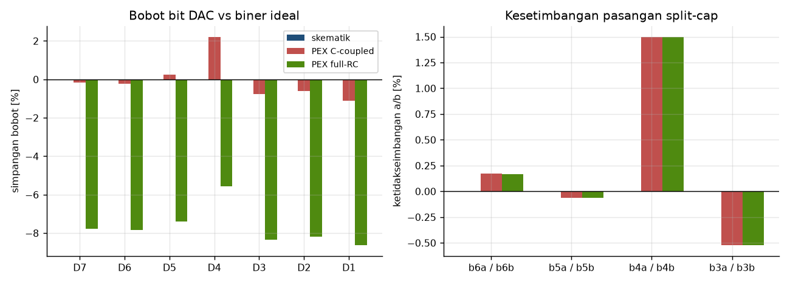
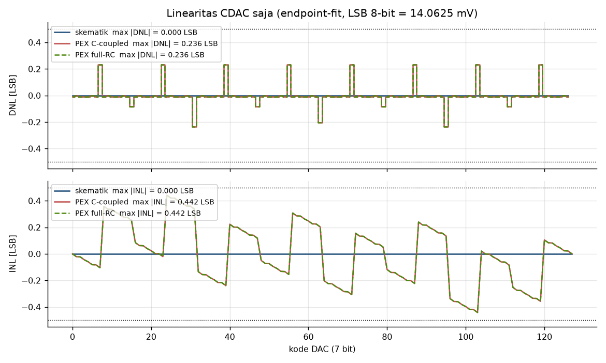
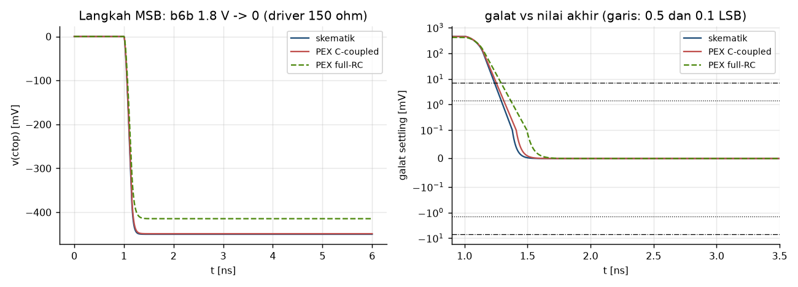
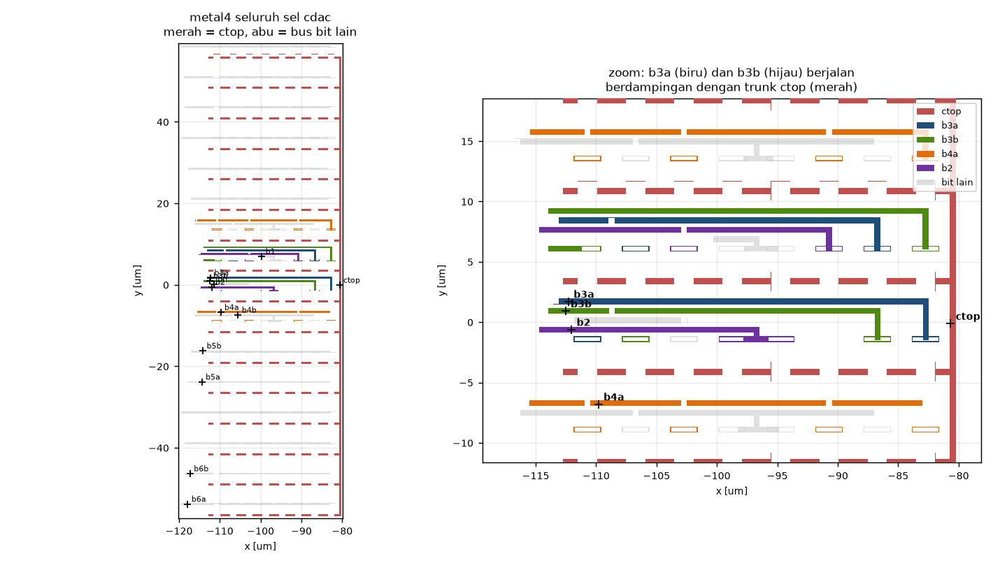
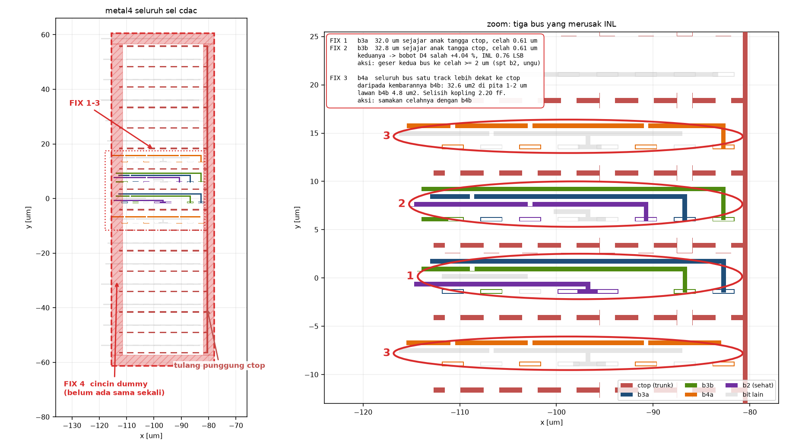
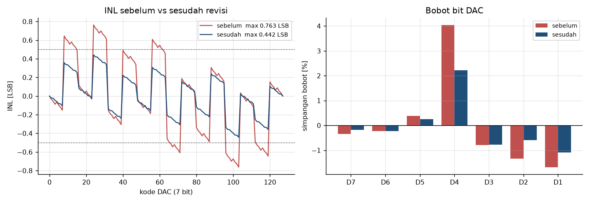

# CDAC: skematik vs PEX

Cara pakai:

```sh
export PATH=/foss/tools/magic/bin:/foss/tools/ngspice/bin:/foss/tools/sak:$PATH
python3 pex/sim/mkdeck.py          # bangun subckt + deck
cd pex/sim && for f in sch pex rc; do ngspice -b w_$f.sp; ngspice -b t_$f.sp; done
python3 pex/sim/analyze.py         # tabel + img/
```

Tiga flavor yang dibandingkan: `sch` (skematik), `pex`
(`sak-pex.sh -m 2`, C-coupled), `rc` (`sak-pex.sh -m 3 -t 100 -r 100 -y 0`).

## Metode

Jaringan CDAC murni kapasitif, jadi **linier**: bobot tiap bottom-plate
`w_k = C_k / C_tot` cukup diukur sekali dengan `.ac` (satu sumber AC per node,
`v(ctop)` langsung sama dengan `w_k`), lalu seluruh 128 level DAC dihitung
dengan superposisi. Ini eksak, bukan aproksimasi, dan jauh lebih murah
daripada tran 256 kode.

Dari skema drive (`cdac_driver`: `A_k = clk_k & D_k`, `B_k = ~clk_k | D_k`),
residu diferensial pada tiap perbandingan adalah

```
r_k = vin_diff + Vref * sum_{j>k} W_j (1 - 2 D_j),   W_k = w_A + w_B
```

Suku bit yang belum diputuskan identik di sisi p dan n sehingga lenyap.
Konsekuensinya: **hanya jumlah `w_A + w_B` yang menentukan linearitas**;
pembagian a/b tidak. Pembagian a/b hanya menentukan drift common-mode `ctop`.

## Hasil

|  | skematik | PEX C-coupled | PEX full-RC |
|---|---|---|---|
| C_total di ctop | 1.1834 pF | 1.2886 pF (+8.89 %) | 1.3587 pF (+14.82 %) |
| gain error CDAC | 0 | +0.013 % | −5.15 % (lihat §3) |
| LSB efektif | 14.0625 mV | 14.0643 mV | 13.3380 mV |
| **max \|DNL\|** | 0.0000 LSB | **0.4569 LSB** | 0.4569 LSB |
| **max \|INL\|** | 0.0000 LSB | **0.7630 LSB** | 0.7630 LSB |
| drift CM ctop | −49.22 mV | −47.70 mV | −45.24 mV |
| settling MSB ke 0.1 LSB | 291 ps | 334 ps | 389 ps |





## 1. Yang gagal: INL 0.76 LSB, semuanya dari bus b3a/b3b

Simpangan bobot bit (PEX C-coupled): D7 −0.34 %, D6 −0.23 %, D5 +0.38 %,
**D4 +4.04 %**, D3 −0.79 %, D2 −1.34 %, D1 −1.68 %.

Asalnya kopling rute bit-line ke `ctop`, di luar kapasitor MIM:

| bit | unit | MIM | rute ke ctop | rasio |
|---|---|---|---|---|
| D7 | 64 | 591.68 fF | 50.38 fF | +8.51 % |
| D6 | 32 | 295.84 fF | 25.57 fF | +8.64 % |
| D5 | 16 | 147.92 fF | 13.76 fF | +9.31 % |
| **D4** | **8** | **73.96 fF** | **9.83 fF** | **+13.29 %** |
| D3 | 4 | 36.98 fF | 2.97 fF | +8.03 % |
| D2 | 2 | 18.49 fF | 1.37 fF | +7.43 % |
| D1 | 1 | 9.25 fF | 0.65 fF | +7.06 % |

Kopling rute yang **proporsional** dengan bobot tidak merusak apa-apa — ia
hanya menskalakan seluruh kurva (gain). Enam dari tujuh bit memang jatuh di
pita +7…+9 %, dan setelah dibagi pertumbuhan C_total 8.89 % simpangannya
tinggal di bawah 1.7 %. Yang keluar jalur hanya D4 dengan +13.3 %: rute
`b3a`/`b3b` menyumbang 9.83 fF, hampir sebanyak `b4a`/`b4b` (13.76 fF)
padahal kapasitornya setengahnya.

Tanda tangannya terlihat jelas di plot INL: gigi gergaji berperiode 8 kode
DAC — persis bobot D4.

**Perbaikan:** pendekkan rute `b3a`/`b3b`, atau samakan panjang lintasan
semua bit-line di bawah `ctop` sehingga kopling per-net proporsional dengan
jumlah unit cap-nya. Menambah shield metal3 ke avss di antara `ctop` dan bus
bit juga menghilangkan masalah, tapi menaikkan C_total lagi.

## 2. Yang ternyata tidak masalah

- **Ketidakseimbangan `b4a`/`b4b` 2.77 %.** Batal di residu diferensial
  (lihat turunan di §Metode), jadi tidak menyentuh INL. Yang tersisa hanya
  drift common-mode `ctop`, dan itu justru **membaik** dari −49.2 mV
  (skematik) ke −47.7 mV. Drift −49 mV itu sendiri arsitektural — `b2`,
  `b1`, `b0` tidak di-split — bukan cacat layout.
- **C_total +8.9 %.** Gain error CDAC praktis nol (+0.013 %) karena kopling
  rute masuk ke pembilang dan penyebut sekaligus. Settling MSB ke 0.1 LSB
  hanya melar 291 → 334 ps; dengan margin timing +21 ns yang sudah terukur,
  ini tidak berarti. Bonus: C lebih besar berarti kT/C sedikit lebih kecil.
- **Resistansi metal.** Total 403 Ω tersebar di 486 segmen, maksimum 13 Ω per
  segmen. Menambah 55 ps lagi pada settling (334 → 389 ps). Tidak kritis.

## 3. Dua mode PEX tidak sepakat soal kapasitansi substrat

| pasangan | C-coupled | full-RC |
|---|---|---|
| ctop ↔ substrat | 0.00 fF | 70.16 fF |
| b6a ↔ substrat | 40.31 fF | 73.15 fF |
| total ke substrat | 89.68 fF | 425.29 fF |
| b6a ↔ ctop | 24.82 fF | 24.82 fF |
| b6b ↔ ctop | 25.56 fF | 25.56 fF |

Kapasitansi antar-sinyal **identik persis** di kedua mode; yang berbeda hanya
cap ke substrat, 4.7× lebih besar di full-RC. `ctop` dirutekan di metal4 di
atas bus metal3, jadi ia hampir seluruhnya ter-shield dari substrat — angka
C-coupled (≈0) masuk akal, angka full-RC (70 fF) tidak. Dugaan: jalur
`extract do resistance` menambahkan cap area penuh tanpa mengurangi bagian
yang sudah dihitung sebagai kopling, alias double count.

Praktisnya: **pakai netlist `-m 2` untuk nilai kapasitansi, pakai `-m 3`
hanya untuk resistornya.**

Yang menenangkan: kesimpulan linearitas **identik di kedua mode**
(INL 0.7630 LSB di dua-duanya), karena cap `ctop`→substrat murni suku gain
yang hilang di endpoint-fit. Jadi perselisihan ini tidak menggoyang temuan §1.

## 4. Catatan alur

- **Netlist PEX tidak bisa langsung disimulasikan.** Magic membuat node
  substrat implisit `w_n23985_n11547#` yang hanya punya kapasitor — tidak ada
  jalur DC. `mkdeck.py` mengikatnya ke pin `vss` (di ADC pin itu = `avss`).
- **`-m 3` saja tidak mengeluarkan resistor.** Default `-y 1` (mindelay 1 ps)
  membuang semua net: Magic menghitung delay dari kapasitansi **metal** net
  itu, sedangkan 1.2 pF MIM-mu adalah *device*, bukan node capacitance. Metal
  saja ~70 fF × 13 Ω ≈ 0.9 ps < 1 ps → semua dibuang. Pakai `-y 0`.

| run | R keluar | nets output |
|---|---|---|
| `-m 3` default | 0 | 0/14 |
| `-t 100`, `-y 1` | 0 | 0/14 |
| `-t` default, `-y 0` | 58 | 6/14 |
| `-t 100 -r 100 -y 0` | 486 | 13/14 |

## 5. Mekanisme geometris: trunk ctop dan bus yang berjalan sejajar dengannya



`ctop` bukan kawat, melainkan **sisir metal4**: satu tulang punggung vertikal
di x ≈ −80.5 µm setinggi seluruh sel, plus 8 anak tangga horizontal (satu per
baris array) yang menjulur ke kiri menjemput pelat atas tiap baris. Itulah
"trunk". Dengan 549.6 µm² ia net metal4 terbesar di sel, ~7× bus bit
terbesar, dan menurut definisinya ia bersinggungan dengan **semua** unit.

Aku pisahkan dua mekanisme kopling secara geometris dari `.ext` + flood-fill
konektivitas:

| bit | unit | ctop_m4 ∩ bit_m3 [µm²] | bit_m4 dlm 1 µm dari trunk [µm²] | kelebihan [fF] |
|---|---|---|---|---|
| b0 | 1 | 0.44 | 0.0 | +0.06 |
| b2 | 4 | 1.77 | 0.0 | −0.01 |
| **b3a** | 4 | 1.77 | **14.9** | **+1.92** |
| **b3b** | 4 | 1.77 | **15.3** | **+1.95** |
| **b4a** | 8 | 3.54 | 0.8 | **+1.82** |
| b4b | 8 | 3.54 | 0.0 | −0.38 |
| b6a | 32 | 14.17 | 1.1 | −0.45 |

- **Tumpang vertikal (ctop m4 di atas pelat m3)** persis proporsional dengan
  jumlah unit — 0.443 µm² per unit, tanpa kecuali. Inilah suku 0.796 fF/unit
  yang rapi itu: gain-netral, tidak merusak apa pun. Korelasi dengan
  kelebihan: r = −0.34, alias tidak ada hubungan.
- **Kedekatan lateral metal4-ke-metal4** menjelaskan kelebihannya:
  r = +0.774 pada radius 1 µm, dan runtuh jadi r = +0.07 pada radius 2 µm.
  Jadi ini efek **jarak-dekat**, bukan "metal besar dekat metal besar".

Di gambar zoom terlihat sebabnya: `b3a` dan `b3b` menempuh lintasan horizontal
panjang yang terjepit di celah antara dua anak tangga `ctop`, lalu berbelok
vertikal mendekati tulang punggung. Kelebihan `b4a` (+1.82 fF) **tidak**
tertangkap metrik 1 µm ini — pola dua lintasan horizontal panjangnya sejajar
anak tangga pada jarak ~3 µm, konsisten tapi belum terbukti; perlu dilihat
langsung di magic.

Konsekuensi untuk perbaikan: yang salah adalah **kopling lateral sesama
metal4**, bukan tumpang vertikal. Shield metal3 tidak bisa menolong — metal3
sudah dipakai pelat bawah MIM, dan lagipula tidak ada tempat untuk menyisipkan
metal3 di antara dua kawat metal4.

## 6. Daftar perbaikan



| # | apa | di mana (µm) | ukuran masalah | aksi |
|---|---|---|---|---|
| **1** | `b3a` | x −113.6…−82.5, y 1.5…2.0 | 32.0 µm sejajar anak tangga `ctop`, celah **0.61 µm** | geser ke celah ≥ 2 µm |
| **2** | `b3b` | x −114.4…−82.5, y 9.0…9.5 | 32.8 µm sejajar, celah **0.61 µm** | geser ke celah ≥ 2 µm |
| **3** | `b4a` | y −9.1…−6.5 dan y 13.3…16.0 | seluruh bus satu track lebih dekat dari kembarannya `b4b` (32.6 µm² di pita 1–2 µm lawan 4.8 µm²; celah min 0.86 vs 1.66 µm) | samakan celahnya dengan `b4b` |
| **4** | cincin dummy | keliling array 16×8 | tidak ada satu pun | tambah cincin, ~52 unit |
| 5 | ekstraksi | — | `-m 3` saja membuang semua R | `-m 2` untuk C, `-m 3 … -y 0` untuk R |
| 6 | node substrat | — | mengambang, tidak bisa disimulasikan | sudah ditangani `mkdeck.py` |

Perkiraan hasil, dihitung dengan mengembalikan kopling bus yang salah ke garis
normal `0.796 x unit − 0.204 fF` lalu menghitung ulang bobot dan INL:

| skenario | max \|INL\| | max \|DNL\| | C_total | galat D4 |
|---|---|---|---|---|
| PEX apa adanya | 0.7629 LSB | 0.4569 LSB | 1.2886 pF | +4.04 % |
| **FIX 1+2 saja** | **0.2556 LSB** | **0.2008 LSB** | 1.2847 pF | −0.46 % |
| FIX 1+2+3 | 0.2446 LSB | 0.1880 LSB | 1.2829 pF | −0.32 % |
| skematik ideal | 0 | 0 | 1.1834 pF | 0 |

**FIX 1 dan 2 saja sudah menyelesaikan kegagalannya** — INL turun 3×, masuk
jauh di bawah ambang ±0.5 LSB. FIX 3 nyaris tidak menyentuh INL (pasangan a/b
batal di residu diferensial); ia dikerjakan demi simetri common-mode. FIX 4
tidak akan pernah terlihat di PEX mana pun.

Angka 0.2556 itu **prediksi model**, bukan hasil ukur: ia mengandaikan kedua
bus kembali ke garis normal. Proksi 2D (jarak, luas) mengurutkan pelaku dengan
benar (r = +0.77 pada radius 1 µm) tapi tidak memprediksi fF secara kuantitatif.
Setelah re-route, ekstrak ulang dan jalankan `pex/sim/` lagi untuk angka aslinya.

## 7. Hasil revisi layout (29 Agu 2026): cincin dummy + re-route sebagian



Layout dinaikkan dari **128 ke 180 device MIM**. Yang 52 tambahan semuanya
**ter-short** (kedua pelat di net yang sama: 38 ctop–ctop, 4+4 b6a/b6b,
2+2 b5a/b5b, 1+1 b3a/b3b), jadi nol kapasitansi dan susunan biner tetap utuh:
ctop–b6a 32, ctop–b6b 32, b5a/b 16, b4a/b 8, b3a/b 4, b2 4, b1 2, b0 1,
dummy lama 1 = tepat 128.

| | sebelum | sesudah | perubahan |
|---|---|---|---|
| C_total ctop | 1.2886 pF | 1.2751 pF | −0.0135 |
| **max \|INL\|** | 0.7630 LSB | **0.4419 LSB** | **−0.3210** |
| **max \|DNL\|** | 0.4569 LSB | **0.2357 LSB** | −0.2211 |
| drift CM ctop | −47.70 mV | −47.85 mV | −0.15 |
| settling MSB ke 0.1 LSB | 334 ps | 312 ps | −22 |

**Sudah lolos ambang ±0.5 LSB.** Kopling ke `ctop` turun di semua bit, tapi
turunnya paling besar justru di net yang ditarget: b3a −25.6 %, b3b −21.8 %,
b4a −18.3 %, lawan median −13 %. Jadi cincin dummy menggeser semuanya, dan
re-route memberi tambahan khusus di tiga net itu.

Total kapasitansi ke substrat (mode C-coupled) turun **89.7 → 14.1 fF**, dan
node substratnya kini bernama `VSUBS`, bukan lagi `w_n<x>_n<y>#`. `mkdeck.py`
sudah menangani kedua konvensi.

### Yang tersisa

Ketiga net yang sama masih pelaku yang sama, kelebihannya baru **turun
separuh**:

| net | kelebihan sebelum | kelebihan sesudah |
|---|---|---|
| b3a | +1.917 fF | +1.002 fF |
| b3b | +1.954 fF | +1.216 fF |
| b4a | +1.819 fF | +1.065 fF |

Garis normalnya sendiri bergeser dari `0.796 x unit − 0.204` ke
`0.704 x unit − 0.176` fF. Bobot D4 masih +2.22 % (dari +4.04 %), dan itu yang
menyisakan INL 0.44 LSB — lolos, tapi marginnya tipis.

Kalau ketiganya diselesaikan sampai ke garis normal:

| skenario | max \|INL\| | max \|DNL\| | D4 |
|---|---|---|---|
| sesudah revisi (terukur) | 0.4419 | 0.2357 | +2.22 % |
| + b3a, b3b ke garis normal | 0.1624 | 0.1403 | −0.39 % |
| + b4a juga | 0.1617 | 0.1299 | −0.31 % |

### Belum diperiksa

LVS. Layout kini punya 180 device, skematik `cdac.sch` masih 128 — dummy
ter-short belum ada di skematik. Jalankan `sak-lvs.sh` sebelum lanjut.
